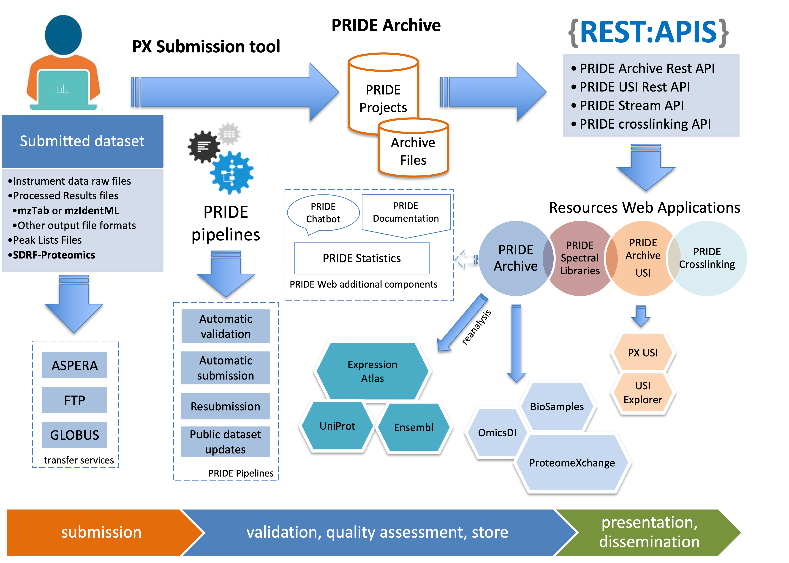

# PRIDE Resources 

Since 2004, the PRoteomics IDEntifications (PRIDE) database (https://www.ebi.ac.uk/pride/) at the European Bioinformatics Institute (EMBL-EBI, Hinxton, Cambridge, UK) has enabled public data deposition of mass spectrometry (MS)-based proteomics data, providing access to the experimental data described in scientific publications. Since then, and especially in recent years, PRIDE Archive (the archival component of PRIDE) has become the largest repository for proteomics data sharing worldwide.

PRIDE stores datasets coming from all MS based proteomics experimental approaches, with a focus on discovery-driven techniques such data-dependent acquisition (DDA) and data independent acquisition (DIA) bottom-up proteomics, but also top-down proteomics and MS imaging, among others. Main Resources: 

- PRIDE Archive https://www.ebi.ac.uk/pride/: PRIDE Archive stores all PRIDE Datasets 
- PRIDE (PX) Submission Tool: Enables Submissions of datasets to PRIDE Archive 
- PRIDE Archive Restful API ( https://www.ebi.ac.uk/pride/ws/archive/v3/webjars/swagger-ui/index.html): Programmatically access to PRIDE Archive data. 

This repository stores PRIDE guidelines on how to submit data, formats for PRIDE Archive, PRIDE Affinity Proteomics Archive PRIDE-AP and PRIDE Crosslinking resource.

- [PRIDE Affinity Proteomics (PRIDE-AP) Archive guidelines](guidelines/pride-affinity-proteomics.md)

In addition, this GitHub repository helps users of PRIDE Resources to interact with PRIDE Team using the PRIDE Resources Forum: https://github.com/PRIDE-Archive/pride-resources/discussions